# pineapple-pizza 🍕🍍🥓

🚧 This is a work in progress... 🦜

## Requirements and Remarks

- on macOS (Sillicon): `go version go1.24.0 darwin/arm64``
- Docker Desktop (at least version 4.41.2)
- DD Extension: Docker MCP Toolkit

### Pull the Models in advance

At the root of the directory, run the following command to pull the models in advance:

```bash
docker compose up
```

### Do a dry run of the demos to get everything in the cache


### Claude AI


### Devcontainer

If you use devcontainer with this project, do not forget that some features related to Docker ModelRunner are not available in the devcontainer.
You will be able to use the REST API, but not the CLI (`docker model ...`) or the Docker Compose integration (`model provider`).

## 00 - DMR, First Contact

- Open Docker Desktop
- First, use the integrated terminal:
```bash
docker model list
docker model run ai/llama3.2 
```
- Ask: `What is docker?`
- Go to the GUI >> choose the **"Models"** menu (*Close the terminal, the models list cannot scroll*)
  - Use `qwen2.5:latest`, click on it and ask: `[For kids] explain docker` (or something else)

🍕 **Other example depending your storytelling**
```raw
"What is the best pizza in the world?"

Then,  explain that you are a big fan of Hawaiian pizza, so you would like to influence the LLM and make it an hawaiian pizza lover.
And move forward in the presentation
```

You can show the model on Docker Hub: [https://hub.docker.com/u/ai](https://hub.docker.com/u/ai)

Or use the **"Docker Hub"** menu of Docker Desktop, and type `ai` into the search text field.

## 01 - Chat Completion with Docker ModelRunner

> This code is in Go, but since you're using the OpenAI SDK API, it's easily reproducible in other languages: [JavaScript, Python, .Net, Java, Go](https://platform.openai.com/docs/libraries#install-an-official-sdk).

**What is doing this source code?**

This Go program creates a chatbot that's an expert on Hawaiian pizza.

### Demo flow

- Show the `.env` file
- Show the `main.go` file
  - Explain quickly the code:
    - Show the various content messages: `systemInstructions`, `knowledgeBase`, the user question
    - Show the usage of the API: `openai.ChatCompletionNewParams` and `Completions.NewStreaming`
- Show the `Dockerfile` file
- Show the `compose.yml` file -> with the Docker Compose model provider


1. **Use a first question**
  ```golang
  userQuestion := "What is your name?"
  ```
2. **Start the application** (a first time)
  ```bash
  docker compose up --build --no-log-prefix
  ```
3. **Change the question** 
  ```golang
  userQuestion := "What is the best pizza in the world?"
  ```
4.**Start again the application**
  ```bash
  docker compose up --build --no-log-prefix
  ```

### Conclusion
- You can influence the model 


## 02 - RAG with Docker ModelRunner

**What is doing this source code?**

This Go program is a more advanced version that implements **Retrieval-Augmented Generation (RAG)** for the Hawaiian pizza chatbot. Here's what it does:

1. Document Processing:
  - Reads all `.md` files from a `/docs` directory
  - Breaks the content into 512-character chunks with 210-character overlap
  - This creates a searchable knowledge base from your documents

2. Vector Embeddings & Storage:
  - Converts each text chunk into numerical vectors (embeddings) using an AI model
  - Stores these embeddings in a Redis database with vector search capabilities
  - Creates a searchable index called "`vector_idx`" for fast similarity searches

3. "Smart" Question Answering:
  - Takes a user question (like `"Is Hawaiian pizza really from Hawaii?"`)
  - Converts the question into an embedding vector
  - Searches Redis to find the 3 most similar document chunks using vector similarity
  - Combines the relevant chunks into a knowledge base

4. AI Response:
  - Sends the user question + relevant document chunks to Bob (the Hawaiian pizza expert)
  - Bob answers using only the information found in the similar documents
  - Streams the response back in real-time


**Flow:**
Question → Convert to vector → Find similar docs → Extract relevant info → Bob answers with that specific knowledge

### Demo flow

- Show the `.env` file
- Show the `main.go` file
  - Explain quickly the code
- Show the `Dockerfile` file
- Show the `compose.yml` file -> with the Docker Compose model provider
  - 2 LLMs
  - 1 Go app (the chatbot)
  - 1 Redis DB


1. **Use a first question**
  ```golang
  userQuestion := "Is Hawaiian pizza really from Hawaii?"
  ```
2. **Start the application** (a first time)
  ```bash
  docker compose up --build --no-log-prefix
  ```
3. 📝 **Explain the output**
4. **Change the question** 
  ```golang
  userQuestion := "Give me regional variations of Hawaiian pizza?"
  ```
5.**Start again the application**
  ```bash
  docker compose up --build --no-log-prefix
  ```
6. 📝 **Explain the output**

```mermaid
graph TB
    subgraph "Docker Compose Services"
        CC[chat-completion<br/>🤖 Main App]
        DCL[download-chat-llm<br/>📥 Chat Model]
        DEL[download-embeddings-llm<br/>📥 Embeddings Model]
        RS[redis-server<br/>🗄️ Vector Database]
        SR[stop-redis<br/>🛑 Cleanup]
    end
    
    subgraph "External Resources"
        ENV[Environment Variables<br/>🔧 Config]
        DOCS[./docs<br/>📚 Documents]
        DATA[./data<br/>💾 Persistence]
        DOCKER[Docker Socket<br/>🐳 Control]
    end
    
    subgraph "Model Runner"
        MR[Model Runner API<br/>🚀 localhost:12434]
    end
    
    %% Dependencies
    CC -.->|depends on| DCL
    CC -.->|depends on| DEL
    CC -.->|uses| RS
    SR -.->|depends on completion| CC
    
    %% Connections
    ENV -->|provides config| CC
    DOCS -->|mounts to /docs| CC
    DATA -->|persists data| RS
    DOCKER -->|controls containers| SR
    
    %% External API
    CC <-->|API calls| MR
    
    %% Port mapping
    RS -->|port 6379| PORT[":6379"]
    
    %% Styling
    classDef service fill:#e1f5fe
    classDef resource fill:#f3e5f5
    classDef external fill:#e8f5e8
    
    class CC,DCL,DEL,RS,SR service
    class ENV,DOCS,DATA,DOCKER resource
    class MR,PORT external
```




## 03 - "Function Calling" with Docker ModelRunner

**What is doing this source code?**

This Go program demonstrates **function calling** (also called "tool use") with an AI model. Here's what it does:

1. Setup:
  - Connects to a local AI model that supports function calling
  - Defines two custom functions the AI can use:
    - `pizzeria_addresses` - Returns pizzeria addresses for a given city
    - `say_hello` - Says hello to someone using their first and last name
2. The Process:
  - **User Request:** Sends a complex request asking the AI to:
    - Find pizzerias in Lyon, France
    - Say hello to "Bob Morane" 
    - Find pizzerias in Tokyo, Japan
  - **AI Decision:** The AI analyzes the request and decides it needs to call functions to fulfill it
  - **Function Calls:** The AI generates structured function calls with the right parameters:
    - `pizzeria_addresses("Lyon")`
    - `say_hello("Bob", "Morane")`
    - `pizzeria_addresses("Tokyo")`
  - **Execution:** The program receives these function calls and executes the actual Go functions:
    - Returns hardcoded pizzeria addresses for Lyon and Tokyo
    - Returns a personalized greeting for Bob Morane

### Demo flow

- Show the `.env` file
- Show the `main.go` file
  - Explain quickly the code: 
    - show the **tools definitions**
    - show that **there are several tool calls** in the user question
    - show the **functions** implementation
    - ...
- Show the `Dockerfile` file
- Show the `compose.yml` file -> with the Docker Compose model provider

1. **Start the application** (a first time)
  ```bash
  docker compose up --build --no-log-prefix
  ```
2. 📝 **Explain the output**

```mermaid
sequenceDiagram
    participant User as 👤 User
    participant App as 🖥️ Go Application
    participant AI as 🤖 AI Model
    participant Funcs as ⚙️ Custom Functions
    
    Note over App: Setup & Tool Definitions
    App->>App: Define pizzeria_addresses() tool
    App->>App: Define say_hello() tool
    App->>App: Register tools with AI client
    
    Note over User,Funcs: Function Calling Process
    User->>App: Complex request:<br/>"Find pizzerias in Lyon & Tokyo<br/>Say hello to Bob Morane"
    
    App->>AI: Send request + available tools
    Note over AI: AI analyzes request<br/>and decides which tools to use
    
    AI->>App: Tool calls:<br/>1. pizzeria_addresses("Lyon")<br/>2. say_hello("Bob", "Morane")<br/>3. pizzeria_addresses("Tokyo")
    
    Note over App: Execute Tool Calls
    App->>Funcs: pizzeria_addresses("Lyon")
    Funcs->>App: "🍕 Pizzerias in Lyon:<br/>1. 123 Pizza St...<br/>2. 456 Pizzeria Ave..."
    
    App->>Funcs: say_hello("Bob", "Morane")
    Funcs->>App: "👋 Hello Bob Morane! 🙂"
    
    App->>Funcs: pizzeria_addresses("Tokyo")
    Funcs->>App: "🍕 Pizzerias in Tokyo:<br/>1. 123 Sushi St...<br/>2. 456 Ramen Ave..."
    
    App->>User: Display all results
    
    Note over App,Funcs: Tool Registry
    rect rgb(240, 248, 255)
        Note over Funcs: Available Functions:<br/>• pizzeria_addresses(city)<br/>• say_hello(firstName, lastName)
    end
```



## 04 - MCP 1st Contact with Claude AI

- Go to Docker Desktop
- Click on **Docker Hub** -> Search for `mcp/sqlite`
- Pull the image
- Then start Claude.AI Desktop and show the developer settings

```json
{
  "mcpServers": {
	"sqlite":{
		"command":"docker",
		"args":["run","-i","--rm","mcp/sqlite"]
	},
}
```

- Show that the tools of the MCP server are avialable
- Try this for the prompt:
```text
create a table friends with these fields first_name last_name
and add 5 friends (choose the names)
```

```text
display all the records of the friends table in markdown format
```


## 05 - MCP 2nd Contact with Claude AI + **Docker MCP Toolkit**

- Go to Docker Desktop
- Go to the **Docker MCP Toolkit extension**
- Search for **Google Maps (Reference)** MCP server
  - Show the list of tools
  - ✋ **Show the settings for the secrets**
  - *if you have an API key, you can use this for the demo*
- Search for the **DuckDuckGo** MCP server
  - Show the list of tools
  - Activate it (✋ there is a rate limitation, don't do too many dry run requests 😉)


**Settings for Claude.AI Desktop**:
```json
{
  "mcpServers": {
	"sqlite":{
		"command":"docker",
		"args":["run","-i","--rm","mcp/sqlite"]
	},
    "MCP_DOCKER": {
      "command": "docker",
      "args": [
        "run",
        "-i",
        "--rm",
        "alpine/socat",
        "STDIO",
        "TCP:host.docker.internal:8811"
      ]
    }
  }
}
```

In Claude.AI Desktop, show the list of tools of `MCP_DOCKER`

Then try this:

```text
Search for pizzerias in lyon (3 results)
```

## 06 - MCP + Golang + OpenAI SDK + **Docker MCP Toolkit**

- I'm using a MCP client with my Golang sourcecode (project: [MCP-Golang](github.com/metoro-io/mcp-golang))
- 2 LLMs
  - one for the function calling completion
  - one for the "classical" chat completion

The application:
1. Create a LLM client
2. Create a connection to the **MCP server** process (handled by the MCP Toolkit)
3. Initialize a **MCP client**
4. Get the list of the available tools thanks to the **MCP client**
5. Convert the "MCP tools" into "OpenAI tools"
6. Execute a tool completion (to get/detect the **tool calls**) with the first LLM
7. Send a `tool/call` request to the **MCP server** thanks to the **MCP client** for each detected tool call
8. Use all the results to make a prompt for the second LLM
9. Execute a chat completion

### ✋✋✋ Limitations
-  Some MCP servers that make search on the web need an API key (Google place and Brave)
-  DuckDuckGo is rate limited

**I'm filtering in the source code, the tools I want to use (search for `filteredTools`)**